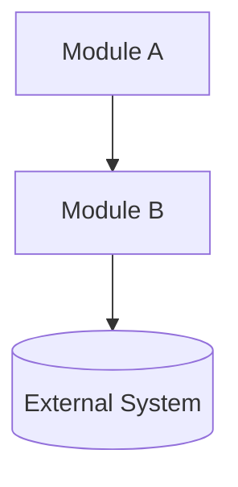
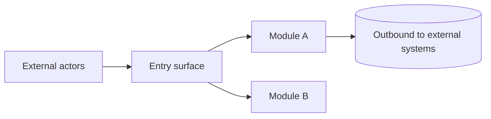
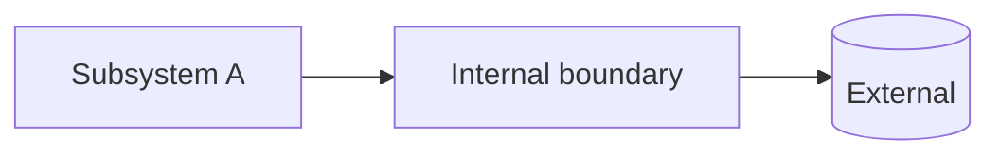
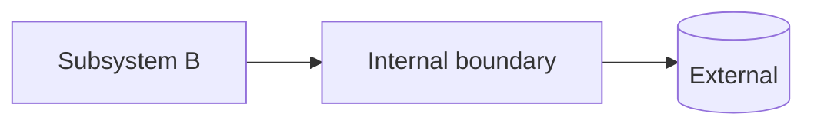

# Architecture Boundary Map

Produce `ARCHITECTURE.md` at the repo root mapping module boundaries across two abstraction levels.

## Steps

### Check existing

Read `<repo-root>/ARCHITECTURE.md` if present. Preserve accurate sections; update only stale parts.

### Analyze deeply (do not rush)

- Map the tree two levels deep.
- Read every manifest in full (`package.json`, `go.mod`, `Cargo.toml`, `pyproject.toml`, `Dockerfile`, monorepo configs).
- Read every entry point and every README.
- Sample 2–3 source files per candidate module — never describe a module from its name alone.
- Map the import graph with `Grep` to confirm dependency directions.
- Locate the data layer (schemas, migrations, API contracts) and runtime boundaries (services, workers, CLIs).
- Identify **public entry surfaces**: HTTP/RPC routes, CLI mains, published library exports, webhooks, message consumers, scheduled jobs, and how auth or credentials apply at each boundary.

### Build hierarchy

- **System context**: whole-system map — include one `### <Module …>` per top-level module (short **role** line + pointer to that module’s subsystems section).
- **Public interface** (in the written doc): how the external world enters and interacts — not another decomposition layer, but a dedicated section tied to modules and entry surfaces.
- **Subsystems**: **expands** each top-level module: for every `### <Module X>` under System context, a matching `### <Module X> — subsystems` with `####` per subsystem; open each subsystems block with a link back to the same module under System context.

### Write to disk

Use the `Write` tool to create `<repo-root>/ARCHITECTURE.md`. Output in chat is not enough — file must exist on disk.

### Verify

File exists at repo root. Every module name matches across TOC, headings, and diagrams. Every cited path exists.

## Rules

- **Naming**: One canonical module name in TOC, headings, body, and diagrams.
- **Entries**: Modules and subsystems include responsibilities, paths, inbound/outbound deps, and boundary constraints. Diagrams only show architecturally significant externals.
- **Public interface**: List entry surfaces with protocol/contract and owning module; split inbound vs outbound when it clarifies boundaries.
- **Unknowns**: Put gaps in Scope, Cross-cutting concerns, or per-module text. A standalone `## Assumptions` is allowed only if it appears in the TOC with a working anchor.
- **Headings**: Do not number section titles (`1.`, `2.1`) or use layer ordinals like “Layer 1” in `ARCHITECTURE.md`; use stable names (e.g. **System context**, **Subsystems**).
- **TOC**: Nested list matches heading depth; every TOC link must match a real heading.
- **System context ↔ Subsystems**: Each `### <Module X>` under System context pairs with `### <Module X> — subsystems` under Subsystems (same module name in both TOC branches); cross-link in the body both ways.

## Template

````md
# Architecture

## Table of Contents

- [System context](#system-context)
  - [Scope](#scope)
  - [Cross-cutting concerns](#cross-cutting-concerns)
  - [Modules](#modules)
  - [<Module A>](#module-a)
  - [<Module B>](#module-b)
- [Public interface](#public-interface)
  - [Surfaces](#surfaces)
  - [Actors](#actors)
  - [Constraints](#constraints)
- [Subsystems](#subsystems)
  - [<Module A>](#module-a--subsystems)
    - [<Subsystem A>](#subsystem-a)
  - [<Module B>](#module-b--subsystems)
    - [<Subsystem B>](#subsystem-b)

## System context

> Whole-system view: what exists, what it owns, and how top-level modules relate to each other and the outside world.

### Scope

<what this document covers>

### Cross-cutting concerns

> Concerns that span modules and must not be silently re-implemented inside a single subsystem.

- **Auth**: <...>
- **Logging**: <...>
- **Config**: <...>
- **Observability**: <...>
- **Error handling**: <...>
- **Feature flags**: <...>

### Modules

| Module     | Path            | Owns  | Depends On | Must Not Depend On |
| ---------- | --------------- | ----- | ---------- | ------------------ |
| <Module A> | `src/module-a/` | <...> | <...>      | <...>              |
| <Module B> | `src/module-b/` | <...> | <...>      | <...>              |

### <Module A>

**Role**: <one sentence — what this module is for in the whole system.>

Internal detail: [<Module A> — subsystems](#module-a--subsystems).

### <Module B>

**Role**: <one sentence — what this module is for in the whole system.>

Internal detail: [<Module B> — subsystems](#module-b--subsystems).



## Public interface

> How the outside world invokes, authenticates to, subscribes to, or observes this system: **entry surfaces** (doors in), not internal subsystems. Tie each surface to its owning module.

### Surfaces

| Direction | Surface (examples)                                            | Owned by module | Contract / notes                    |
| --------- | ------------------------------------------------------------- | --------------- | ----------------------------------- |
| Inbound   | <HTTP API, CLI, npm exports, webhook URL, queue subscription> | <Module A>      | <protocol, auth model, idempotency> |
| Outbound  | <callbacks, webhooks you call, client SDKs to third parties>  | <Module B>      | <when they fire, failure semantics> |

### Actors

**Actors**: <humans via CLI, browser clients, partner backends, other repos importing this package, …>

### Constraints

**Constraints**: <what callers must not do, rate limits, versioning, breaking-change policy for public API>



## Subsystems

> Expands each row in [Modules](#modules) and each module blurb under [System context](#system-context). Same module names as there; here: subsystems only.

### <Module A> — subsystems

Expands [<Module A>](#module-a) from system context.

#### <Subsystem A>

**Path**: `src/module-a/subsystem-a/`
**Responsibilities**: <what this subsystem is solely responsible for>
**Inbound**: <who calls into this subsystem and how>
**Outbound**: <what this subsystem calls or emits>
**Constraints**: <rules this subsystem must never violate>



### <Module B> — subsystems

Expands [<Module B>](#module-b) from system context.

#### <Subsystem B>

**Path**: `src/module-b/subsystem-b/`
**Responsibilities**: <...>
**Inbound**: <...>
**Outbound**: <...>
**Constraints**: <...>


````

## Checklist

- [ ] File written via `Write` tool to repo root
- [ ] Manifests, entry points, READMEs all read
- [ ] Source files sampled per module
- [ ] Import graph confirmed via `Grep`
- [ ] All cited paths exist
- [ ] TOC nesting matches heading depth; every link resolves to a real `##` / `###` / `####` heading
- [ ] Each `### <Module …>` under System context has a matching `### <Module …> — subsystems`; the same module name appears under both **System context** and **Subsystems** in the TOC
- [ ] Names consistent across TOC, headings, diagrams
- [ ] Public interface section lists entry surfaces, owners, and inbound vs outbound where useful
- [ ] Mermaid diagrams where the template calls for them (system view, public interface, each subsystem)
