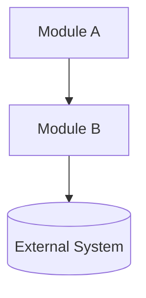
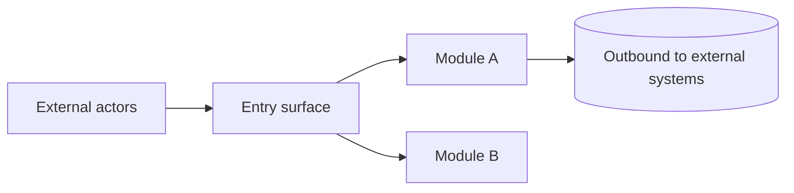
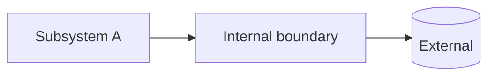
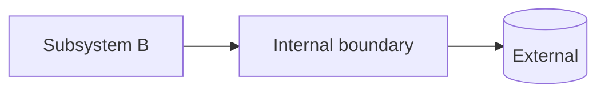

# Architecture Boundary Map

Produce `ARCHITECTURE.md` at the repo root mapping module boundaries across two abstraction levels.

## Steps

### 1. Check existing

Read `<repo-root>/ARCHITECTURE.md` if present. Preserve accurate sections; update only stale parts.

### 2. Analyze deeply (do not rush)

- Map the tree two levels deep.
- Read every manifest in full (`package.json`, `go.mod`, `Cargo.toml`, `pyproject.toml`, `Dockerfile`, monorepo configs).
- Read every entry point and every README.
- Sample 2–3 source files per candidate module — never describe a module from its name alone.
- Map the import graph with `Grep` to confirm dependency directions.
- Locate the data layer (schemas, migrations, API contracts) and runtime boundaries (services, workers, CLIs).
- Identify **public entry surfaces**: HTTP/RPC routes, CLI mains, published library exports, webhooks, message consumers, scheduled jobs, and how auth or credentials apply at each boundary.

### 3. Build hierarchy

- **Level 1**: whole-system map — include one `### <Module …>` per top-level module (short **role** line + pointer to Layer 2 expansion).
- **Public interface** (in the written doc): how the external world enters and interacts — not a third abstraction layer, but a dedicated section tied to Level 1 modules and entry surfaces.
- **Level 2**: **expands** each Level 1 module: for every `### <Module X>` in Layer 1, a matching `### <Module X> — subsystems` with `####` per subsystem; open each Layer 2 module block with a link back to the same module’s Layer 1 heading.

### 4. Write to disk

Use the `Write` tool to create `<repo-root>/ARCHITECTURE.md`. Output in chat is not enough — file must exist on disk.

### 5. Verify

File exists at repo root. Every module name matches across TOC, headings, and diagrams. Every cited path exists.

## Rules

- One canonical name per module everywhere.
- Each module entry: responsibilities, file paths, inbound deps, outbound deps, boundary constraints.
- Show only architecturally significant externals in diagrams.
- Document **public interfaces** explicitly: name each entry surface, who invokes it, protocol or contract, and which Level 1 module owns it; separate inbound (world → system) from outbound (system → world) where it clarifies the boundary.
- State unknowns inline in **Scope and coverage**, **Cross-Cutting Concerns**, or module/subsystem entries. If you add a standalone `## Assumptions` (or similar), put it in the TOC with a real anchor — otherwise skip it.
- **Table of Contents shape**: Mirror document tree — use nested list (2 spaces per level). Optional bold **group labels** (`System boundary`, `Internal decomposition`) group related `##` sections; under each `##` / `###` / `####`, indent TOC children to match heading depth. Every linked TOC line must match a real heading so anchors resolve (add `###` / `####` subheadings where the TOC nests deeper).
- **Layer 1 ↔ Layer 2 continuity**: Same canonical **module name** appears in TOC twice — once under **Layer 1** (context: `### <Module X>`) and once under **Layer 2** (`### <Module X> — subsystems` → subsystems). Body text cross-links (Layer 1 → “subsystems below”; Layer 2 → “expands [Module X](#…) from system context”).
- **Mermaid fence height (hard requirement)**: Small diagrams overlay adjacent markdown in some editors; pad with blank lines after the last diagram line until the inner line count is high enough.
  - **Mostly horizontal** (`flowchart LR`, `flowchart RL`, `graph LR`, `graph RL`): target **about 5 inner lines total** (diagram + padding). Add only the blanks needed so the fence is roughly that tall, not a tall stack of padding.
  - **Vertical or mixed** (`flowchart TD`/`TB`, `graph TD`/`TB`, sequence/state, and other layouts): target **at least 15 inner lines** (diagram + padding).

## Template

````md
# Architecture

## Table of Contents

- **System boundary**
  - [Layer 1 — System Context](#layer-1--system-context)
    - [Scope and coverage](#scope-and-coverage)
    - [Cross-Cutting Concerns](#cross-cutting-concerns)
    - [Module inventory](#module-inventory)
    - [<Module A>](#module-a)
    - [<Module B>](#module-b)
  - [Public interface](#public-interface)
    - [Surface summary](#surface-summary)
    - [External actors](#external-actors)
    - [Public boundary constraints](#public-boundary-constraints)
- **Internal decomposition**
  - [Layer 2 — Subsystem Boundaries](#layer-2--subsystem-boundaries)
    - [<Module A>](#module-a--subsystems)
      - [<Subsystem A>](#subsystem-a)
    - [<Module B>](#module-b--subsystems)
      - [<Subsystem B>](#subsystem-b)

## Layer 1 — System Context

> The 10,000-foot view. What exists, what it owns, and how the top-level modules relate to each other and the outside world.

### Scope and coverage

<what this document covers>

### Cross-Cutting Concerns

> Concerns that apply across both layers and must not be silently re-implemented inside any single subsystem.

- **Auth**: <...>
- **Logging**: <...>
- **Config**: <...>
- **Observability**: <...>
- **Error handling**: <...>
- **Feature flags**: <...>

### Module inventory

| Module     | Path            | Owns  | Depends On | Must Not Depend On |
| ---------- | --------------- | ----- | ---------- | ------------------ |
| <Module A> | `src/module-a/` | <...> | <...>      | <...>              |
| <Module B> | `src/module-b/` | <...> | <...>      | <...>              |

### <Module A>

**Role**: <one sentence — what this module is for in the whole system.>

Internal detail: [<Module A> — subsystems](#module-a--subsystems).

### <Module B>

**Role**: <one sentence — what this module is for in the whole system.>

Internal detail: [<Module B> — subsystems](#module-b--subsystems).



## Public interface

> The **contract with the outside world**: how external actors invoke, authenticate to, subscribe to, or observe this system. This section names **entry surfaces** (the doors in), not internal subsystems. Tie each surface to the owning Level 1 module.

### Surface summary

| Direction | Surface (examples)                                            | Owned by module | Contract / notes                    |
| --------- | ------------------------------------------------------------- | --------------- | ----------------------------------- |
| Inbound   | <HTTP API, CLI, npm exports, webhook URL, queue subscription> | <Module A>      | <protocol, auth model, idempotency> |
| Outbound  | <callbacks, webhooks you call, client SDKs to third parties>  | <Module B>      | <when they fire, failure semantics> |

### External actors

**Actors**: <humans via CLI, browser clients, partner backends, other repos importing this package, …>

### Public boundary constraints

**Constraints**: <what callers must not do, rate limits, versioning, breaking-change policy for public API>



## Layer 2 — Subsystem Boundaries

> Expands each **Module** from [Module inventory](#module-inventory) and the per-module blurbs in [Layer 1 — System Context](#layer-1--system-context). Same module names as Level 1; here: subsystems only.

### <Module A> — subsystems

Expands [<Module A>](#module-a) from system context.

#### <Subsystem A>

**Path**: `src/module-a/subsystem-a/`
**Responsibilities**: <what this subsystem is solely responsible for>
**Inbound**: <who calls into this subsystem and how>
**Outbound**: <what this subsystem calls or emits>
**Constraints**: <rules this subsystem must never violate>



### <Module B> — subsystems

Expands [<Module B>](#module-b) from system context.

#### <Subsystem B>

**Path**: `src/module-b/subsystem-b/`
**Responsibilities**: <...>
**Inbound**: <...>
**Outbound**: <...>
**Constraints**: <...>


````

## Checklist

- [ ] File written via `Write` tool to repo root
- [ ] Manifests, entry points, READMEs all read
- [ ] Source files sampled per module
- [ ] Import graph confirmed via `Grep`
- [ ] All cited paths exist
- [ ] TOC nested like document tree (groups + heading depth); TOC links match real `##` / `###` / `####` anchors
- [ ] Each Level 1 `### <Module …>` has a Level 2 `### <Module …> — subsystems`; same module name in TOC under both **System boundary** and **Internal decomposition**
- [ ] Names consistent across TOC, headings, diagrams
- [ ] Public interface section lists entry surfaces, owners, and inbound vs outbound where useful
- [ ] Mermaid diagram at every documented level; horizontal `LR`/`RL` fences ≈5 inner lines; vertical `TD`/`TB` (and similar) ≥15 inner lines (pad with blanks)
