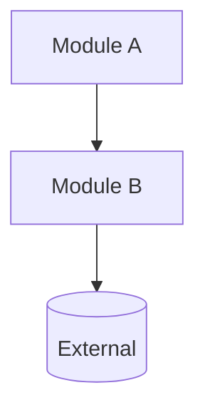
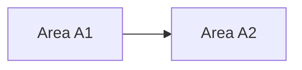
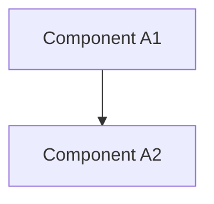

# Architecture Boundary Map

Produce `ARCHITECTURE.md` at the repo root mapping module boundaries across up to 3 abstraction levels.

## Steps

### 1. Check existing

Read `<repo-root>/ARCHITECTURE.md` if present. Preserve accurate sections; update only stale parts.

### 2. Analyze deeply (do not rush)

- Map the tree two levels deep.
- Read every manifest in full (`package.json`, `go.mod`, `Cargo.toml`, `pyproject.toml`, `Dockerfile`, monorepo configs).
- Read every entry point and every README.
- Sample 2–3 source files per candidate module — never describe a module from its name alone.
- Map the import graph with `Grep` to confirm dependency directions.
- Locate the data layer (schemas, migrations, API contracts) and runtime boundaries (services, workers, CLIs).

### 3. Build hierarchy

- **Level 1**: whole-system map.
- **Level 2**: internal decomposition of each Level 1 module.
- **Level 3**: only for subsystems with 3+ internal components; otherwise write a one-line note.

### 4. Write to disk

Use the `Write` tool to create `<repo-root>/ARCHITECTURE.md`. Output in chat is not enough — file must exist on disk.

### 5. Verify

File exists at repo root. Every module name matches across TOC, headings, and diagrams. Every cited path exists.

## Rules

- One canonical name per module everywhere.
- Each module entry: responsibilities, file paths, inbound deps, outbound deps, boundary constraints.
- Show only architecturally significant externals in diagrams.
- State unknowns in the Assumptions section.
- **Mermaid fence height (hard requirement)**: Inside every ` ```mermaid ` … ` ``` ` block, there must be **at least 10 lines of content** (diagram lines + blank padding lines). Small diagrams overlay adjacent markdown in some editors; pad with blank lines after the last mermaid line until the inner line count reaches 20.

## Template

````md
# Architecture

## Table of Contents

- [1. System Context](#1-system-context)
- [2. Subsystem Boundaries](#2-subsystem-boundaries)
- [3. Component Boundaries](#3-component-boundaries)
- [4. Cross-Cutting Concerns](#4-cross-cutting-concerns)
- [5. Assumptions](#5-assumptions)

## 1. System Context

**Scope**: <what this document covers>

**Submodules**

- **<Module A>** (`src/module-a/`): <1 sentence>
- **<Module B>** (`src/module-b/`): <1 sentence>

| Module     | Paths           | Owns  | Depends On | Must Not Depend On |
| ---------- | --------------- | ----- | ---------- | ------------------ |
| <Module A> | `src/module-a/` | <...> | <...>      | <...>              |



## 2. Subsystem Boundaries

### 2.1 <Subsystem A>

**Paths**: `src/module-a/`
**Responsibilities**: <...>
**Inbound**: <...>
**Outbound**: <...>
**Constraints**: <...>



## 3. Component Boundaries

### 3.1 <Subsystem A> / <Component Group>

- **<Component A1>** (`src/module-a/component-a1/`): <...>
- **<Component A2>** (`src/module-a/component-a2/`): <...>
- **<Component A3>** (`src/module-a/component-a3/`): <...>



### 3.2 <Subsystem B>

_Fewer than 3 components — no decomposition._

## 4. Cross-Cutting Concerns

- <auth, logging, config, observability, feature flags, error handling>

## 5. Assumptions

- <...>
````

## Checklist

- [ ] File written via `Write` tool to repo root
- [ ] Manifests, entry points, READMEs all read
- [ ] Source files sampled per module
- [ ] Import graph confirmed via `Grep`
- [ ] All cited paths exist
- [ ] Level 3 only where 3+ components exist
- [ ] Names consistent across TOC, headings, diagrams
- [ ] Mermaid diagram at every documented level; each ` ```mermaid ` block has ≥20 inner lines (pad with blanks)
