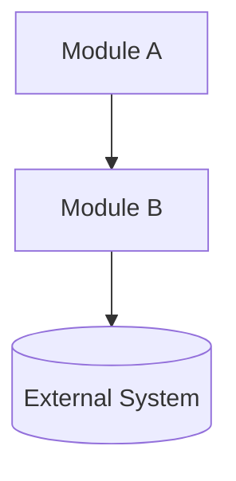
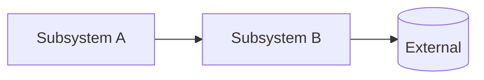

# Architecture Boundary Map

Produce `ARCHITECTURE.md` at the repo root mapping module boundaries across two abstraction levels.

## Steps

### 1. Check existing

Read `<repo-root>/ARCHITECTURE.md` if present. Preserve accurate sections; update only stale parts.

### 2. Analyze deeply (do not rush)

- Map the tree two levels deep.
- Read every manifest in full (`package.json`, `go.mod`, `Cargo.toml`, `pyproject.toml`, `Dockerfile`, monorepo configs).
- Read every entry point and every README.
- Sample 2–3 source files per candidate module — never describe a module from its name alone.
- Map the import graph with `Grep` to confirm dependency directions.
- Locate the data layer (schemas, migrations, API contracts) and runtime boundaries (services, workers, CLIs).

### 3. Build hierarchy

- **Level 1**: whole-system map.
- **Level 2**: internal decomposition of each Level 1 module.

### 4. Write to disk

Use the `Write` tool to create `<repo-root>/ARCHITECTURE.md`. Output in chat is not enough — file must exist on disk.

### 5. Verify

File exists at repo root. Every module name matches across TOC, headings, and diagrams. Every cited path exists.

## Rules

- One canonical name per module everywhere.
- Each module entry: responsibilities, file paths, inbound deps, outbound deps, boundary constraints.
- Show only architecturally significant externals in diagrams.
- State unknowns in the Assumptions section.
- **Mermaid fence height (hard requirement)**: Small diagrams overlay adjacent markdown in some editors; pad with blank lines after the last diagram line until the inner line count is high enough.
  - **Mostly horizontal** (`flowchart LR`, `flowchart RL`, `graph LR`, `graph RL`): target **about 5 inner lines total** (diagram + padding). Add only the blanks needed so the fence is roughly that tall, not a tall stack of padding.
  - **Vertical or mixed** (`flowchart TD`/`TB`, `graph TD`/`TB`, sequence/state, and other layouts): target **at least 15 inner lines** (diagram + padding).

## Template

````md
# Architecture

## Table of Contents

- [System Context](#system-context)
- [Subsystem Boundaries](#subsystem-boundaries)
- [Cross-Cutting Concerns](#cross-cutting-concerns)
- [Assumptions](#assumptions)

## Layer 1 — System Context

> The 10,000-foot view. What exists, what it owns, and how the top-level modules relate to each other and the outside world.

**Scope**: <what this document covers>

**Modules**

| Module     | Path            | Owns  | Depends On | Must Not Depend On |
| ---------- | --------------- | ----- | ---------- | ------------------ |
| <Module A> | `src/module-a/` | <...> | <...>      | <...>              |
| <Module B> | `src/module-b/` | <...> | <...>      | <...>              |



## Layer 2 — Subsystem Boundaries

> The mid-level view. Each module is broken into subsystems with clear responsibilities, interfaces, and constraints.

### <Module A> / <Subsystem A>

**Path**: `src/module-a/subsystem-a/`
**Responsibilities**: <what this subsystem is solely responsible for>
**Inbound**: <who calls into this subsystem and how>
**Outbound**: <what this subsystem calls or emits>
**Constraints**: <rules this subsystem must never violate>



### <Module B> / <Subsystem B>

**Path**: `src/module-b/subsystem-b/`
**Responsibilities**: <...>
**Inbound**: <...>
**Outbound**: <...>
**Constraints**: <...>

## Cross-Cutting Concerns

> Concerns that apply across both layers and must not be silently re-implemented inside any single subsystem.

- **Auth**: <...>
- **Logging**: <...>
- **Config**: <...>
- **Observability**: <...>
- **Error handling**: <...>
- **Feature flags**: <...>

---

## Assumptions

- <...>
````

## Checklist

- [ ] File written via `Write` tool to repo root
- [ ] Manifests, entry points, READMEs all read
- [ ] Source files sampled per module
- [ ] Import graph confirmed via `Grep`
- [ ] All cited paths exist
- [ ] Names consistent across TOC, headings, diagrams
- [ ] Mermaid diagram at every documented level; horizontal `LR`/`RL` fences ≈5 inner lines; other layouts ≥10 inner lines (pad with blanks)
