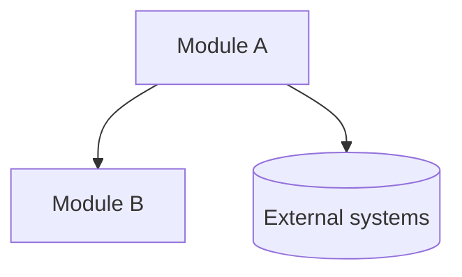

# High-level architecture

Write **`ARCHITECTURE.md`** at the repository root: **what the system is**, **major modules**, **how they relate**, and **how the outside world connects**.

**Out of scope for this skill**: per-module subsystem trees, folder-by-folder breakdowns, component inventories, deep import graphs inside a module—use **`architecture-modules-detail`** (writes `ARCHITECTURE_MODULES.md` beside this file) or **`architecture-boundary-map`** (inlines **Subsystems** into a single `ARCHITECTURE.md`).

## Output contract

- **Table of contents** at the top; entries must match real headings (no numeric section titles like `1.` or “Layer 1”).
- **System context**: scope; optional cross-cutting concerns; module inventory + one-line roles; **one** whole-system Mermaid diagram.
- **Public interface**: surfaces (who owns what), actors, constraints; **one** Mermaid diagram.
- Persist with the **`Write`** tool (not chat-only).

## Steps

### Check existing

Read `<repo-root>/ARCHITECTURE.md` if present. Update stale high-level sections; leave deeper sections untouched unless you are explicitly replacing the whole doc.

### Discover (stay high level)

- Infer **top-level modules** from layout, manifests (`package.json`, `go.mod`, `Cargo.toml`, `pyproject.toml`, …), and READMEs.
- List **entry surfaces** at a summary level (which HTTP areas, CLIs, exported APIs, queues, cron)—not every handler or file path.
- Use **`Grep`** sparingly to confirm **dependency direction between modules**, not inner-package wiring.

### Write

Use the template below. Do **not** add “Subsystems”, “Components”, or equivalent nested decomposition sections.

### Verify

TOC links resolve; names match across TOC, tables, and diagrams; every cited path exists.

## Rules

- **Naming**: One canonical module name everywhere.
- **Headings**: Stable titles (**System context**, **Public interface**)—no numbered prefixes or layer ordinals.
- **Diagrams**: Modules and significant externals only—no internal class or folder explosions.
- **Unknowns**: Note gaps under Scope or Cross-cutting concerns.

## Template

````md
# Architecture

## Table of Contents

- [System context](#system-context)
  - [Scope](#scope)
  - [Cross-cutting concerns](#cross-cutting-concerns)
  - [Modules](#modules)
  - [<Module A>](#module-a)
  - [<Module B>](#module-b)
- [Public interface](#public-interface)
  - [Surfaces](#surfaces)
  - [Actors](#actors)
  - [Constraints](#constraints)

## System context

### Scope

<repos, services, or packages this document covers>

### Cross-cutting concerns

> Omit this subsection if nothing truly spans modules.

- **Auth**: <…>
- **Config**: <…>

### Modules

| Module | Path | Role | Depends on | Must not depend on |
| ------ | ---- | ---- | ---------- | ------------------- |
| <Module A> | `<path>/` | <one phrase> | <modules / externals> | <modules> |
| <Module B> | `<path>/` | <one phrase> | <…> | <…> |

### <Module A>

**Role**: <one sentence—what this module does in the whole system.>

### <Module B>

**Role**: <one sentence—what this module does in the whole system.>



## Public interface

### Surfaces

| Direction | Surface | Owned by | Notes |
| --------- | ------- | -------- | ----- |
| Inbound | <API / CLI / …> | <Module> | <auth, contract> |
| Outbound | <webhooks / SDK calls / …> | <Module> | <failure semantics> |

### Actors

<Who invokes the system: users, partners, other repos, …>

### Constraints

<Versioning, compatibility, limits, things external callers must not rely on.>


````

## Checklist

- [ ] `ARCHITECTURE.md` written to repo root via `Write`
- [ ] No subsystem or component decomposition sections
- [ ] TOC matches headings; links work
- [ ] One Mermaid diagram under **System context**, one under **Public interface**
- [ ] Module names consistent across TOC, tables, and diagrams

## Related skills

- **`architecture-modules-detail`**: reads this `ARCHITECTURE.md`, runs parallel subagents per module, writes **`ARCHITECTURE_MODULES.md`** for medium-depth module and interface detail.
- **`architecture-boundary-map`**: keeps everything in one `ARCHITECTURE.md` including **Subsystems** sections.
