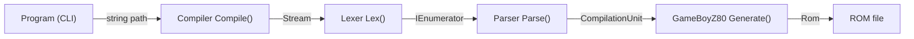
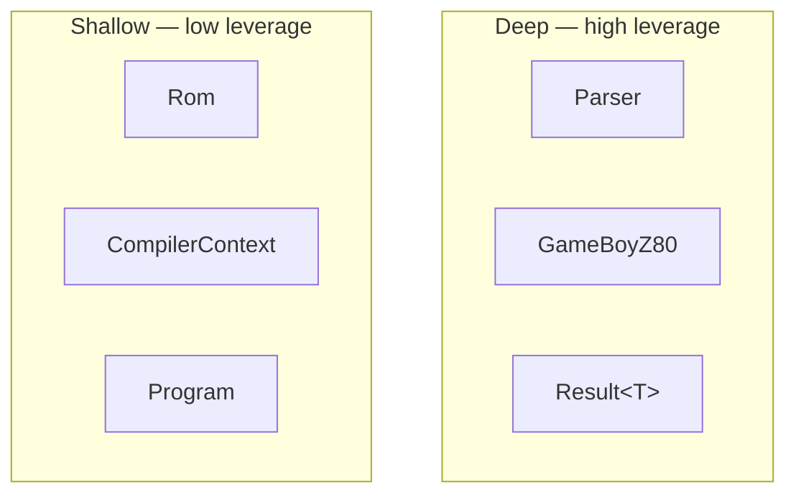
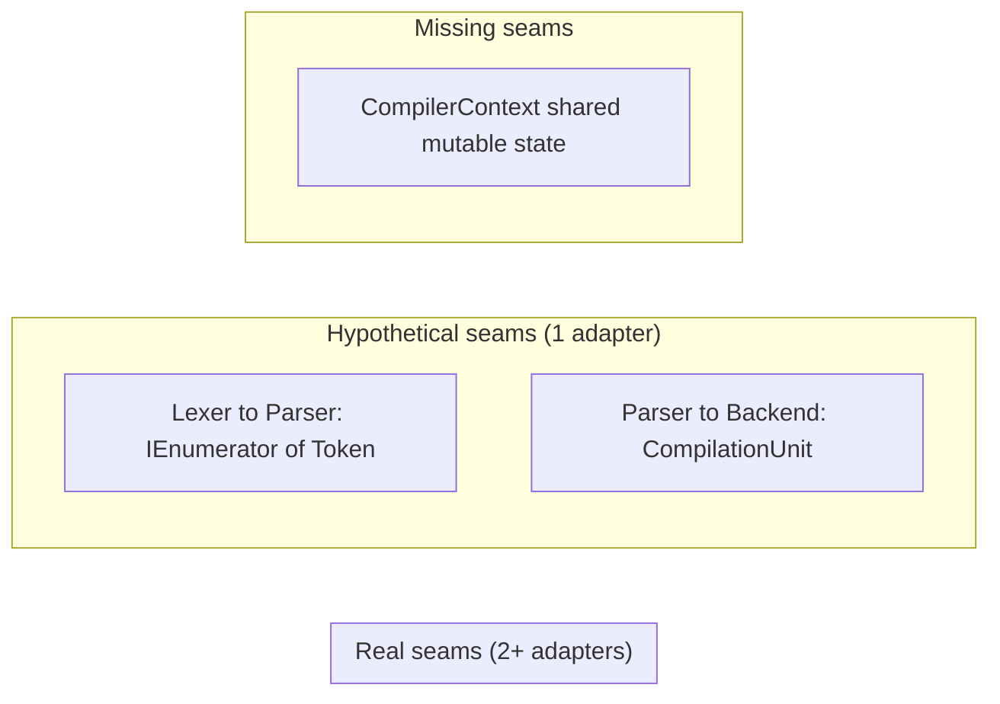

# Analyse Architecture

Produce a structured architecture analysis of a codebase using the shared vocabulary defined
in `references/LANGUAGE.md`. Read that file before writing a single word of the analysis —
consistent terminology is the point.

---

## Workflow

### 1. Load vocabulary (required first step)

Read `references/LANGUAGE.md` now. Every term in the analysis must come from that file.
Do not substitute "component", "service", "API", or "boundary" for the canonical terms.

### 2. Discover the codebase

If the user has not pointed you at specific files, explore the project tree to orient yourself:

```bash
find . -type f \( -name "*.ts" -o -name "*.tsx" -o -name "*.js" -o -name "*.py" \
  -o -name "*.go" -o -name "*.rs" -o -name "*.java" -o -name "*.cs" \) \
  ! -path "*/node_modules/*" ! -path "*/.git/*" ! -path "*/dist/*" \
  | head -120
```

Then read the files that are most likely to reveal module boundaries and seams:

- Entry points (`main.*`, `index.*`, `app.*`, `server.*`)
- Package manifests (`package.json`, `go.mod`, `Cargo.toml`, `pyproject.toml`)
- Directory structure at 2–3 levels deep
- Any files named `*interface*`, `*contract*`, `*types*`, `*schema*`

Read enough to form an honest opinion. Do not guess at interfaces you have not seen.

### 3. Run `archscan` (data-driven phase)

Use the `archscan` tool to collect all module metrics and compute derived analysis.
This replaces manual metric collection — the tool is deterministic, same code produces
the same JSON every time.

```bash
# Scan + enrich in one step (produces .context/architecture.json)
archscan /path/to/project
```

If `archscan` is not available **STOP** and inform the user.

The output file `.context/architecture.json` contains:

| Field                  | Description                                                          |
| ---------------------- | -------------------------------------------------------------------- |
| `loc`                  | Lines of code (non-blank, non-comment)                               |
| `exports.*`            | Exported types, functions (`()` suffix), classes, constants          |
| `imports.list`         | Distinct import paths                                                |
| `fanIn`                | Number of other files importing this module                          |
| `fanOut`               | Number of other modules this file imports                            |
| `adapterCount`         | Detected adapter implementations (by naming convention)              |
| `adapterPaths`         | File paths of each detected adapter                                  |
| `seamLocation`         | Primary entry point (first exported function/class + file path)      |
| `testsPierceInterface` | Tests access private/internal symbols                                |
| `testFilePaths`        | Matching test files (`*.test.*`, `*.spec.*`)                         |
| `interfaceSurface`     | Total count of exported symbols                                      |
| `depthRatio`           | `loc` / `interfaceSurface` — higher = deeper                         |
| `depthAssessment`      | Deep / Shallow / Unclear                                             |
| `seamQuality`          | Real (2+ adapters) / Hypothetical (1) / Missing (0 with surface > 3) |
| `isPassThrough`        | True if low fan-in + tiny surface + small LOC                        |

### 4. Read the data and verify

Read `.context/architecture.json`. Skim the module list to confirm the tool
captured the significant modules. Spot-check 2–3 modules by reading their source files
to verify the exported symbols and LOC are accurate. If `archscan` missed key exports
or misidentified a module, note the correction mentally — you will use it in the prose.

At this stage you are reviewing the data, not rewriting it. The quantitative fields
(loc, fan-in, exports) come from the tool. Your job is to supply qualitative judgments
the tool cannot make: invariants, ordering constraints, error modes, performance
characteristics.

### 5. Apply the four principles

Run each principle as an explicit check, using the data file as your primary source:

**Depth check**

- Sort modules by `depthRatio` descending. Modules marked `Deep` with high `fanIn` are
  the leverage points. Modules marked `Shallow` with `fanIn` 0–1 are pass-throughs.
- High `fanOut` + low `fanIn` confirms a pass-through: name them.

**Deletion test**

- For each module, note its `fanIn`. If `fanIn` is 0–1 and `adapterCount` is 0–1,
  deleting it makes complexity vanish (pass-through). If `fanIn` is high, complexity
  reappears across callers (earning its keep). Cite the `fanIn` number.

**Interface-as-test-surface**

- Check `testsPierceInterface` for each module. If true, flag the module as the wrong
  shape and cite the `testFilePaths`.

**One-adapter / Two-adapter rule**

- Use `adapterCount` from the data. A seam with one adapter (or zero) is hypothetical —
  note whether it is justified or speculative complexity. Use `seamQuality` field as
  a starting point.

### 6. Write the analysis report

Structure the report exactly as follows.

---

````markdown
# Architecture Analysis: <Project Name>

## Overview

One paragraph. What is this project doing, and what is the dominant structural pattern
(layered, pipeline, plugin host, hexagonal, etc.)? Use module/interface/seam vocabulary.

Then emit a Mermaid pipeline/graph diagram showing how modules relate — data flow,
ownership, seam crossings. Use `flowchart LR` for pipelines, `flowchart TD` for
layered/hierarchical systems. Annotate edges with the type that crosses each seam
(e.g. the token type, the AST node, the result type). Example shape:



Color convention (convey via subgraph labels, not style blocks):

- **Deep modules** — place in a subgraph labeled "Deep — high leverage"
- **Shallow modules** — place in a subgraph labeled "Shallow — low leverage"
- **Problem areas** — place in a subgraph labeled "Problem — missing seam"
- **Entry/exit nodes** — use simple label nodes without subgraphs

## Module Inventory

For each significant module, use a level-3 heading. Do not use bold prefixes.
Write two to five sentences of prose per module. End each entry with a one-line
metadata block. Group related modules under a level-2 subheading if it aids clarity.

### ModuleName (`path/to/file`)

Prose: interface summary, what callers must know, depth verdict with reason,
seam location, adapter count and whether the seam is hypothetical or real.

> **Depth:** Deep · **Seam:** `MethodName()` · **Adapters:** 1 (hypothetical)

## Depth Map

Emit a Mermaid bar/quadrant chart or a ranked table showing each module's depth
verdict at a glance. A simple approach that always works is a flowchart grouping
modules into swim-lanes by depth:



Follow with one paragraph of prose: where is the real leverage concentrated, and
where does interface complexity nearly match implementation complexity?

## Seam Quality

Prose section. Which seams are real (two+ adapters or a clear variation axis)?
Which are hypothetical (one adapter — and is the abstraction paying for itself)?
Which are missing but should exist?

Optionally include a Mermaid diagram highlighting seam health if the project has
many seams worth comparing at a glance:



## Deletion Test Results

Prose section. Which modules are earning their keep? Which are pass-throughs?
What complexity would reappear across callers if a shallow module were deleted?

## Risks & Recommendations

Rank the top three to five concerns by severity. For each, use a level-3 heading.

### Risk 1: <short title> — Severity: High / Medium / Low

Prose: describe the problem using interface/seam/depth/adapter vocabulary, explain
the concrete consequence (change amplification, test fragility, poor locality), and
give a specific remediation with a file or method path where the fix should land.

## Summary

Two to four sentences. What is architecturally strong? What is the single most
important thing to change?
````

---

## Output rules

- **Run `archscan` before writing prose.** If unavailable, collect metrics manually from
  source files — every number must come from reading actual files, do not estimate or guess.
- **Use only the vocabulary from `references/LANGUAGE.md`** — module, interface, depth,
  seam, adapter, leverage, locality. If you catch yourself writing "component", "service",
  "API", or "boundary", stop and reword.
- **Each module gets a level-3 heading**, not a bold prefix. Never write `**ModuleName**`.
- **No style blocks in diagrams.** Use subgraph labels to convey depth/seam categories instead of fill colors.
- Write prose in sections — no bullet lists in section bodies.
- Be direct. "This module is shallow and should be deleted" is better than hedging.
- Cite file paths and function/class names when making specific claims.
- Do not pad. If a section has nothing interesting to say, say so in one sentence and move on.
- Do not emit the module inventory internal table verbatim in the final report.
- Write the document to `.context/ARCHITECTURE.md`
- When citing quantitative claims (fan-in, adapter count, depth ratio), include the number
  from the data file so the reader can verify.
- The data file is the source of truth for metrics; do not contradict it in prose.

---

## Reference files

- `references/LANGUAGE.md` — canonical vocabulary; read before starting.
- `.context/architecture.json` — structured metrics produced by `archscan`; read before
  writing prose or diagrams. If this file exists from a prior run, run `archscan` again to
  refresh — do not rely on stale data.
