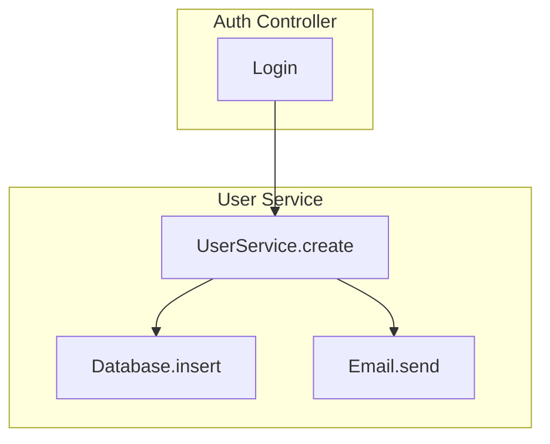

If you want the logic of **CodeMarp** (which is written in Rust/Python/C++ variants) but with **native TypeScript support**, your best bet is building a specialized script using **ts-morph**.

Because `ts-morph` wraps the official TypeScript compiler, it "understands" things that simple regex-based tools miss: like interfaces, inherited methods, and cross-file imports.

---

## The "TS-Native" Architecture

To get better TS support than generic tools, your script needs to utilize the **Type Checker**. This allows you to resolve a call like `service.getData()` to its actual definition, even if `service` is injected via a constructor or defined in a different file.

### 1. The Core Logic (using `ts-morph`)

This script traverses your repo and builds a **Map** of callers and callees.

```typescript
import { Project, SyntaxKind, Node } from "ts-morph";

const project = new Project({ tsConfigFilePath: "tsconfig.json" });
const diagramLines: string[] = ["graph TD"];

// 1. Grab all source files
const sourceFiles = project.getSourceFiles();

sourceFiles.forEach((file) => {
  // 2. Look for functions, methods, and arrow functions
  const callables = [
    ...file.getFunctions(),
    ...file.getDescendantsOfKind(SyntaxKind.MethodDeclaration),
    ...file.getDescendantsOfKind(SyntaxKind.ArrowFunction),
  ];

  callables.forEach((callable) => {
    const callerName = Node.isMethodDeclaration(callable)
      ? `${callable.getParent().getName()}.${callable.getName()}`
      : callable.getName() || "anonymous";

    // 3. Find all call expressions inside this callable
    callable.getDescendantsOfKind(SyntaxKind.CallExpression).forEach((call) => {
      try {
        const symbol = call.getExpression().getSymbol();
        if (symbol) {
          const calleeName = symbol.getName();
          // Filter out standard library calls (like .log or .map) if desired
          if (!symbol.getDeclarations()[0]?.getSourceFile().isInNodeModules()) {
            diagramLines.push(`  ${callerName} --> ${calleeName}`);
          }
        }
      } catch (e) {
        // Handle cases where the type cannot be resolved
      }
    });
  });
});

console.log(diagramLines.join("\n"));
```

### 2. Why this is "Better Support"

Standard static analysis often breaks on:

- **Aliases:** `import { log as print } from './utils'`. The compiler knows `print` is actually `log`.
- **Interfaces:** If you call `repo.save()`, the Type Checker can tell you which class implements that `save` method.
- **Enums/Types:** It ignores type-only "calls" that don't exist at runtime.

---

## Generating Mermaid Diagrams

Since you want Mermaid output, you can enhance the script to handle **Subgraphs** (grouping functions by the file they live in). This makes the graph much more readable for large repos.

### Mermaid Formatting Strategy

Instead of a flat list, you can structure your output like this:



To achieve this in your script, wrap the `caller --> callee` lines in `subgraph` blocks based on `file.getBaseName()`.

---

## Advanced Feature: Control Flow (Internal Logic)

If you want to go deeper than just "Function A calls Function B" and actually see the **logic flow** (e.g., "If User exists -> Update, Else -> Create"), you need to inspect `IfStatements` and `SwitchStatements`.

> **Note:** True Control Flow Graphs (CFGs) are much noisier. For a "data repo," you usually want a **Data Flow Graph**, tracking how a specific variable moves from an API request into the Database.

### Recommended Libraries for the Heavy Lifting

If you decide not to write the traversal logic yourself, these libraries are the "TypeScript-native" answer to CodeMarp:

1.  **[TypeStat](https://github.com/JoshuaKGoldberg/TypeStat):** Primarily for refactoring, but has incredible utilities for traversing TS projects with full type safety.
2.  **[TS-Graphviz](https://github.com/ts-graphviz/ts-graphviz):** If you want to programmatically generate complex graphs before converting them to Mermaid or SVG.

---

### Implementation Tips

- **Ignore Node Modules:** Always filter out `node_modules` unless you want a graph with 5,000 nodes including `React` or `Lodash` internals.
- **Deduplication:** Use a `Set` to store your edges (e.g., `caller + '->' + callee`) so you don't get 20 arrows between the same two functions if one calls the other inside a loop.
- **Max Depth:** For large repos, implement a "depth" limit so the graph doesn't become an unreadable "hairball."

Are you planning to run this as a **CLI tool** for CI/CD, or are you looking to build a **VS Code Extension** to visualize this while you code?
